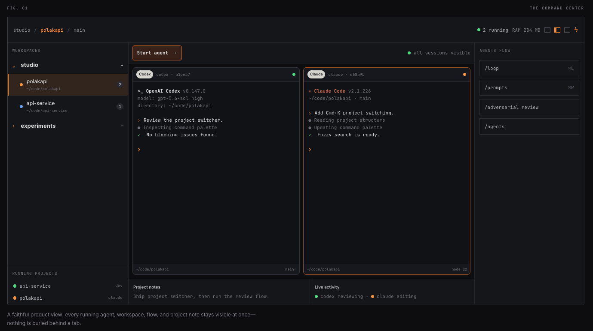

# polakapi

polakapi is a cross-platform desktop workspace for running AI coding agents and terminal sessions side by side.



## Highlights

- Run multiple terminal-based coding agents in a single window.
- Organize repositories and sessions into persistent workspaces.
- Manage active processes, notes, prompts, and agent workflows from one interface.
- Use Claude Code, Codex, OpenCode, or any other terminal-based tool.

## Getting Started

### Requirements

- Git
- Node.js 22
- pnpm 11.8
- Rust stable
- [Tauri prerequisites](https://v2.tauri.app/start/prerequisites/) for your operating system

### Windows Setup

Native Windows development requires the following components:

1. Install [Microsoft C++ Build Tools](https://visualstudio.microsoft.com/visual-cpp-build-tools/). Select the **Desktop development with C++** workload and keep a Windows SDK selected.
2. Install the [Microsoft Edge WebView2 Evergreen Runtime](https://developer.microsoft.com/en-us/microsoft-edge/webview2/) if it is not already present. It is included with current Windows 10 and Windows 11 installations.
3. Install Rust with [rustup](https://rustup.rs/), select the MSVC host toolchain, and restart PowerShell.
4. Install Node.js 22 and enable the repository's pnpm version with Corepack.

Verify the toolchain from a new PowerShell window:

```powershell
rustup default stable-msvc
rustup component add rustfmt clippy
corepack enable
corepack prepare pnpm@11.8.0 --activate
```

After cloning the repository and installing its dependencies, the Tauri environment report should show WebView2, MSVC, `rustc`, and Cargo as available:

```powershell
pnpm tauri info
```

### Run Locally

On Windows, use PowerShell:

```powershell
git clone https://github.com/rafaelje/polakapi.git
Set-Location polakapi
pnpm install --frozen-lockfile
pnpm tauri info
pnpm tauri dev
```

On macOS or Linux:

```sh
git clone https://github.com/rafaelje/polakapi.git
cd polakapi
pnpm install --frozen-lockfile
pnpm tauri dev
```

AI coding CLIs are optional and must be installed separately and available on your `PATH`.

### Build on Windows

Build the NSIS installer from PowerShell:

```powershell
pnpm tauri build --bundles nsis
Get-ChildItem .\src-tauri\target\release\bundle\nsis\*-setup.exe
```

Using an explicit NSIS target avoids the optional MSI toolchain. Running `pnpm tauri build` without `--bundles` follows `tauri.conf.json` and builds all Windows bundle targets. MSI builds may require enabling the Windows VBSCRIPT optional feature, as described in the [Tauri Windows installer guide](https://v2.tauri.app/distribute/windows-installer/).

Run the complete local quality gate before contributing:

```powershell
pnpm run check
```

### Windows Troubleshooting

- Run `pnpm tauri info` first; it reports missing WebView2, MSVC, Rust, Node.js, and package-manager components.
- If `rustc` or Cargo is not found after installing rustup, open a new PowerShell window and run `rustup default stable-msvc`.
- If compilation cannot find `cl.exe` or `link.exe`, modify the Visual Studio Build Tools installation and add the **Desktop development with C++** workload, then restart PowerShell.
- If WebView2 is missing, install the Evergreen Runtime and restart the app.
- If `pnpm` is unavailable and Corepack is not installed, run `npm install --global pnpm@11.8.0`.
- Restart PowerShell and polakapi after installing or updating an AI coding CLI so the app receives the updated `PATH`.

## Contributing

See [CONTRIBUTING.md](CONTRIBUTING.md) for development and contribution guidelines. Security vulnerabilities should be reported according to [SECURITY.md](SECURITY.md).

## License

polakapi is available under the [MIT License](LICENSE).
