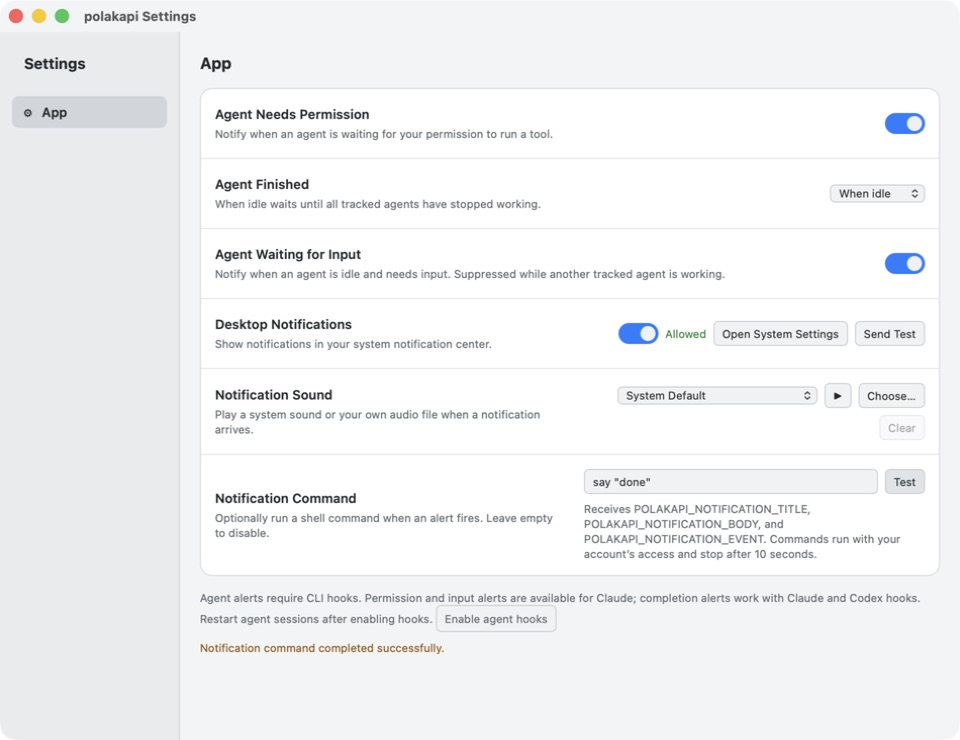
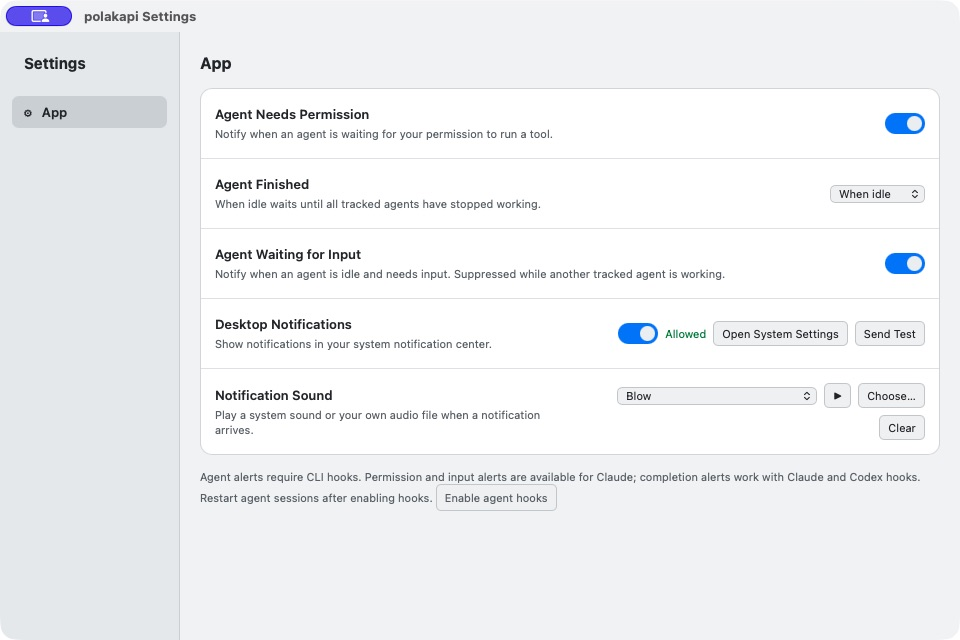
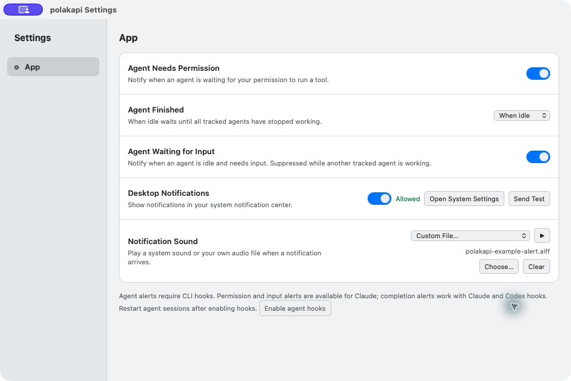

# App settings and notifications

Open **polakapi → Settings…** (`Cmd+,` on macOS, `Ctrl+,` elsewhere). The settings window has one **App** section with six rows:

- **Agent Needs Permission**: permission alerts from Claude hooks.
- **Agent Finished**: Never, Immediately, or When idle. Idle delivery waits for tracked terminal agents, Claude subagents, and active loop runs.
- **Agent Waiting for Input**: idle-input alerts from Claude hooks, suppressed while other tracked work is active.
- **Desktop Notifications**: enable desktop delivery, inspect plugin permission status, open system notification settings, or send a test.
- **Notification Sound**: system default, no sound, installed system sounds, or a custom audio file, with preview, stop, and clear actions. Starting a new preview replaces the one still playing.
- **Notification Command**: an optional shell command, disabled when empty. Edits save when you leave the field. **Test** runs the entered command and reports success, a nonzero exit code, or a timeout. Sound previews do not run it.

The command runs for alerts that pass the existing event preferences and terminal-bell focus/throttle rules, independently of desktop permissions and sound selection. It receives `POLAKAPI_NOTIFICATION_TITLE`, `POLAKAPI_NOTIFICATION_BODY`, and `POLAKAPI_NOTIFICATION_EVENT` as environment variables. Event values are `permission`, `finished`, `waiting`, `bell`, `test`, or `notification`. Notification text is passed as data, never inserted into the command itself.

Commands use `/bin/sh -c` on macOS/Linux and `powershell.exe -NoProfile -NonInteractive -Command` on Windows, with your home directory as the working directory. They run with your account’s existing access and environment, without an interactive terminal. Use absolute paths for scripts; interactive shell aliases are unavailable. For example, macOS can speak the alert with `say "$POLAKAPI_NOTIFICATION_BODY"`. PowerShell accesses it as `$env:POLAKAPI_NOTIFICATION_BODY`.

Each app instance runs at most one notification command at a time. An overlapping command is skipped with an error; commands time out after 10 seconds and their process tree is stopped. Command output is discarded, and automatic failures appear as a toast without blocking agent work or the other delivery methods. The saved command is stored locally in `notifications.json`; avoid putting secrets in it.

Use **Enable agent hooks** once and restart existing Claude/Codex sessions. It installs or updates polakapi-managed hooks while preserving user hooks. Claude supports permission, waiting, completion, and subagent tracking; Codex uses the existing completion hook integration. Agents without compatible hooks still have terminal-bell notifications. Completion of a loop run also uses these preferences.

Preferences are saved in `notifications.json` in the app configuration directory and propagate to the running main window. Hook events use a bounded, transient SQLite queue; they do not save assistant response content. Old queued events expire after 30 seconds. Idle detection covers events observed by polakapi, not arbitrary external processes or future scheduled tasks.

On macOS, sounds are discovered in `/System/Library/Sounds`, `/Library/Sounds`, and `~/Library/Sounds`. Windows lists its Media directory and uses WAV files. Linux lists standard freedesktop/GNOME sounds and requires `paplay` for previews/custom playback; the system-settings shortcut targets GNOME. Focus modes and OS notification settings control whether a banner is visible. Custom sounds remain independent of the desktop-delivery toggle.

**polakapi → Check for updates...** checks the existing GitHub release source on demand, reports success or failure, and offers to open the download page when a newer release exists. It does not install updates automatically.

## Screenshots

Notification command with a successful test:

App settings with a system notification sound selected:

Custom notification sound controls:

